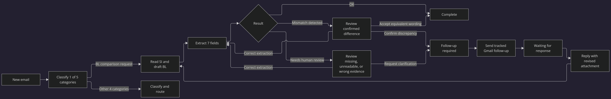
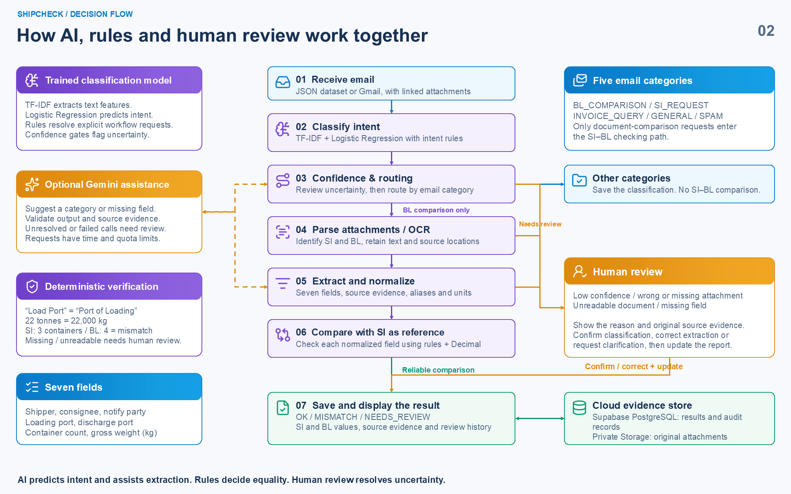
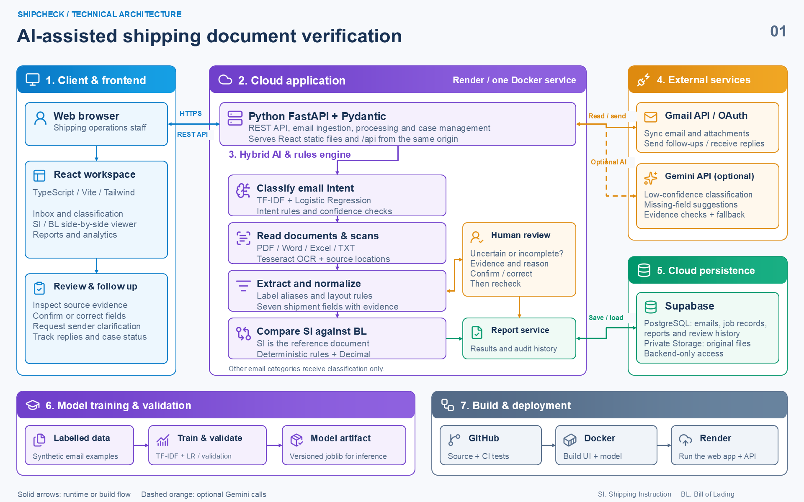

# ShipCheck

**AI-assisted shipping document verification for a shared operations inbox**

[Live application](https://shipcheck-qmyl.onrender.com) · [API documentation](https://shipcheck-qmyl.onrender.com/docs) · [Deployment guide](docs/DEPLOYMENT.md) · [Validation evidence](docs/VALIDATION.md)

ShipCheck classifies incoming operational email, identifies Bill of Lading (BL) comparison requests, extracts seven required fields from the Shipping Instruction (SI) and draft BL, and shows the exact source evidence behind every decision. Reliable matches complete automatically. Confirmed differences and uncertain inputs enter separate operator workflows, where the decision and subsequent Gmail follow-up remain attached to one case.

The application is an end-to-end prototype for the **Averis × Monash Hackathon 2026 Shipping Document Verification** use case. It combines a trained text classifier, deterministic business rules, optional Gemini assistance, human review, Gmail, and persistent cloud storage. The SI remains the reference document throughout the comparison.

> **Evaluation note:** results reported below are reproducible on the supplied synthetic dataset and a separately generated seed-73 regression dataset. They are not claims of perfect accuracy on unrestricted production email.

## Contents

- [Part 1 — Product, architecture and evidence](#part-1--product-architecture-and-evidence)
  - [1. ShipCheck at a glance](#1-shipcheck-at-a-glance)
  - [2. Problem and solution](#2-problem-and-solution)
  - [3. Key features and demonstration](#3-key-features-and-demonstration)
  - [4. Technology stack and cloud infrastructure](#4-technology-stack-and-cloud-infrastructure)
  - [5. Results and evaluation strategy](#5-results-and-evaluation-strategy)
- [Part 2 — Folder guide](#part-2--folder-guide)
- [Part 3 — Local setup on Windows](#part-3--local-setup-on-windows)
- [Part 4 — API and deployment overview](#part-4--api-and-deployment-overview)
- [Part 5 — Team](#part-5--team)

---

## Part 1 — Product, architecture and evidence

### 1. ShipCheck at a glance

ShipCheck turns a shared shipping inbox into a traceable decision workspace:

1. Receive an email from the supplied JSON dataset, Gmail, or the provider-neutral ingestion API.
2. Classify it into one of five required categories.
3. Route only BL comparison requests into document verification.
4. Read TXT, PDF, DOCX or XLSX attachments, using OCR when a PDF page has no extractable text.
5. Identify the SI and draft BL, extract the seven required fields, and retain a quote plus source location for each value.
6. Normalize equivalent representations and compare the draft BL against the SI reference.
7. Save an `OK`, `MISMATCH`, or `NEEDS_REVIEW` result with its evidence and audit history.
8. Let an operator resolve only the cases that need judgment, contact the sender through Gmail, track the reply, and re-check the newest documents.

The current supplied dataset contains **520 emails**. The reproducible saved evaluation identifies **454 OK outcomes, 46 document mismatches, and 20 human-review cases**. These counts describe the supplied evaluation data; new Gmail messages produce their own live results.

### 2. Problem and solution

#### End-to-end case lifecycle

[](docs/images/shipcheck-case-lifecycle.png)

*Figure 1. Email classification, comparison outcomes, human decisions, tracked Gmail follow-up, and revised-document reprocessing. Select the image to open the full-resolution diagram.*

Shipping operations teams receive mixed email intents in one inbox. Only some messages request an SI–draft BL comparison, yet every comparison can contain formatting variation, missing files, scanned pages, incomplete fields, or real commercial discrepancies. A simple string comparison creates false alarms; an unconstrained language model can hide uncertainty or invent a value.

ShipCheck addresses each part of that problem explicitly:

| Operational problem | ShipCheck response |
|---|---|
| Mixed requests share one mailbox | Hybrid intent routing classifies all five required email categories. |
| Only comparison requests need document checking | Non-comparison categories are saved and routed without entering the SI–BL pipeline. |
| SI and draft BL use different layouts and labels | Format-specific readers, label aliases, normalization and exact source evidence create a common seven-field representation. |
| Formatting differences can look like defects | Case, punctuation, line breaks, address separators, optional UN/LOCODE suffixes and supported units are normalized before equality is decided. |
| Missing, duplicated, unreadable or wrong documents make automation unsafe | The pipeline escalates with one of four explicit review reasons instead of guessing. |
| A detected difference still needs a business action | The Action queue records the operator's decision, creates a case, prepares or sends a tracked follow-up, and waits for the reply. |
| Revised documents arrive later | Gmail thread data and the generated `[SC-email_id]` marker link the response to the original case; newest attachments are displayed and reprocessed. |
| Cloud restarts must not erase evidence | Supabase PostgreSQL stores emails, reports and review history; private Supabase Storage stores original attachment bytes. |

### 3. Key features and demonstration

#### AI, rules and human decision flow



*Figure 2. The trained classifier routes intent, deterministic rules decide equality, optional Gemini assists bounded cases, and operators resolve uncertainty.*

#### 3.1 Workflow intent routing

The deployed classifier is a hybrid pipeline. TF-IDF features and Logistic Regression handle free-form email text, while explicit intent rules resolve recurring, unambiguous workflow phrases. Confidence gates send uncertain classifications to review. Optional Gemini assistance is called only for low-confidence routing or unresolved fields; it does not replace the local pipeline.

| Required category | System action |
|---|---|
| `BL_COMPARISON` | Read the SI and draft BL and run the seven-field comparison. |
| `SI_REQUEST` | Classify and route a request for a new Shipping Instruction. |
| `INVOICE_QUERY` | Classify and route to finance or billing. |
| `GENERAL` | Classify and route as a general operational email. |
| `SPAM` | Classify with no operational follow-up. |

The report records the predicted category, confidence, and whether the decision came from the trained classifier, an explicit intent rule, Gemini assistance, or human confirmation.

#### 3.2 Seven-field extraction and precise comparison

For every valid comparison request, the SI is the source of truth. ShipCheck extracts and compares:

1. Shipper
2. Consignee
3. Notify party
4. Port of loading
5. Port of discharge
6. Container count
7. Gross weight in kilograms

Each side-by-side row contains the raw value, normalized value, result, attachment path, quoted source text, and location information. The normalizer supports known field aliases and common layout variations. It converts explicit metric tonnes to kilograms with Python `Decimal`, recognizes supported container expressions, removes an optional trailing UN/LOCODE for port comparison, and ignores presentational punctuation and line breaks in party names and addresses. It does not apply an arbitrary numeric tolerance.

The comparison produces three distinct outcomes:

- **OK** — all seven values are readable and aligned; the result completes automatically.
- **MISMATCH** — both documents were read reliably and at least one normalized value differs; an operator must confirm the business meaning of the difference.
- **NEEDS_REVIEW** — a reliable comparison cannot yet be made because evidence is missing, unreadable, ambiguous, or of the wrong type.

#### 3.3 Multimodal documents and OCR

| Format | Reader and evidence retained |
|---|---|
| TXT | UTF-8 text with line ranges |
| PDF with a text layer | `pdfplumber` text plus page and bounding-box locations |
| Scanned PDF | `pypdfium2` page rendering and Tesseract OCR with page, pixel box and confidence |
| DOCX | Paragraph and table-cell locations through `python-docx` |
| XLSX | Worksheet row locations through `openpyxl` |

OCR output remains conservative. A page that required OCR is identified in the evidence, and low-confidence OCR or OCR-produced party-name differences stay in human review even when extracted strings appear to match. This prevents an apparent match from being treated as proof that a scan was read correctly.

#### 3.4 Human-in-the-loop Action queue

`MISMATCH` and `NEEDS_REVIEW` are separate because they answer different questions:

- A mismatch says **the system read both documents and found a real value difference**.
- Human review says **the system does not yet have enough reliable evidence to decide**.

The four reliability labels used for human review are:

| Review reason | Meaning |
|---|---|
| `wrong_doc_type` | An attachment is not a uniquely identifiable SI or draft BL, or multiple candidates exist. |
| `missing_attachment` | A comparison request does not contain one readable SI and one readable draft BL. |
| `unreadable` | A file or OCR result cannot be trusted with enough confidence. |
| `missing_value` | A required field is blank, a placeholder, repeated, ambiguous, or absent. |

The review form displays only decisions that apply to the current outcome:

| Queue outcome | Available decisions | Result |
|---|---|---|
| `MISMATCH` | **Confirm discrepancy** | Create a follow-up case because the readable draft BL value must be corrected or confirmed. |
| `MISMATCH` | **Correct an extracted value** | Enter the value shown in the source and recompute the comparison without changing the original file. |
| `MISMATCH` | **Accept equivalent wording** | Record equivalent party-name or address presentation and complete automatically if all seven fields align. This option is unavailable when an operational field differs or any field is unresolved. |
| `NEEDS_REVIEW` | **Request clarification** | Create a follow-up case because information or readable evidence is missing. |
| `NEEDS_REVIEW` | **Correct an extracted value** | Enter a verified source value and recompute the comparison without changing the original file. |

For a non-BL email with uncertain intent, the reviewer confirms the email category instead of seeing SI–BL comparison decisions.

Reviews use the latest report ID as an optimistic concurrency check. If processing changed the report while a reviewer was working, the API returns a conflict instead of silently overwriting newer evidence. Every new processing or review result is appended, and earlier report versions remain visible in the audit history.

#### 3.5 Gmail and Google Workspace workflow

With Gmail configured, ShipCheck:

- polls the authorized Inbox and offers an immediate **Sync Gmail** action;
- imports supported attachments and uses stable Gmail message IDs to prevent duplicate ingestion;
- processes newly imported mail through the same pipeline and cloud persistence path;
- sends an individual tracked follow-up through the connected operations mailbox after confirmation;
- sends all reviewed, follow-up-ready cases through the Gmail API after one confirmation;
- adds `[SC-email_id]` to the subject and retains Gmail thread information;
- detects sent follow-ups and moves cases to **Waiting for response**;
- associates matching Inbox replies with the original case;
- displays the newest response and attachments before the original request; and
- re-runs the SI–BL comparison on the latest case documents, automatically completing the case when all seven fields align.

The application requests only Gmail read and send scopes. OAuth client secrets and refresh tokens stay in backend environment variables and are never exposed through `VITE_*` variables or returned to the browser.

#### 3.6 Operator workspace

The React interface includes:

- **Inbox** — search, category/status filters, multi-select processing, report history, original evidence, and archiving;
- **Action queue** — mismatch review, reliability review, follow-up-ready cases, failed processing, and confirmed batch follow-up;
- **Archive** — hides selected mail from the active workspace without deleting Gmail messages, attachments, reports, or audit records;
- **Analytics** — processing outcomes, category volume, workflow states, mismatch fields, human-review reasons, optional Gemini status, and clearly labelled offline validation metrics; and
- **Batch progress** — a live progress bar appears only while an inbox batch is running.

#### 3.7 Judge testing mailbox and demonstration path

Judges can send a test message from their own email account to **`shipcheckclyvy@gmail.com`**. ShipCheck imports it through the configured Gmail connection. After the judge records a follow-up decision, **Send follow-up** asks for confirmation and the backend sends the message from `shipcheckclyvy@gmail.com` through its stored Gmail OAuth token. The judge receives that message in the same personal or work inbox used to submit the test and can reply with a revised attachment. Access to the ShipCheck Gmail account itself is not required.

The Gmail password is intentionally not published. The application uses backend OAuth credentials, while evaluators interact through the public ShipCheck workspace and their own sender inbox.

A judge can exercise the main workflow without editing data:

1. Open the [live application](https://shipcheck-qmyl.onrender.com) and inspect the four KPI cards.
2. Open an `OK` comparison and expand **View source** to see the evidence behind both field values.
3. Filter the Action queue by **Mismatch detected** and confirm a real discrepancy, correct an extraction, or accept equivalent wording.
4. Filter by **Needs human review** and inspect the concrete reliability label and missing evidence.
5. Confirm a follow-up decision; use **Send follow-up** for one case or **Send all follow-ups** for all confirmed cases. Both actions use the backend Gmail connection.
6. Reply in the tracked Gmail thread with a revised attachment, select **Sync Gmail**, and inspect the newest response at the top of the case.
7. Open **Analytics** to inspect live operational counts and the separate frozen evaluation artifacts.

### 4. Technology stack and cloud infrastructure

#### Deployed technical architecture



*Figure 3. React and FastAPI run in one Render container, with Supabase persistence, Gmail integration, optional Gemini assistance, and a versioned local classifier artifact.*

| Layer | Implemented technology | Role in ShipCheck |
|---|---|---|
| Frontend | React 19, TypeScript, Vite, Tailwind CSS, React Router, Fetch API | Responsive inbox, evidence viewer, review workflow and analytics |
| Application API | Python, FastAPI, Pydantic, Uvicorn | Validated REST contracts, orchestration, Gmail integration and static frontend hosting |
| Trained AI | scikit-learn TF-IDF + Logistic Regression, joblib | Five-class email intent prediction |
| Optional generative AI | Gemini REST API | Low-confidence category suggestion and evidence-constrained missing-field suggestion |
| Deterministic verification | Python regex, aliases, Unicode normalization, `Decimal` | Document typing, seven-field extraction, normalization and equality decisions |
| Document processing | `pdfplumber`, `pypdfium2`, `python-docx`, `openpyxl` | Text, page, table and worksheet extraction |
| OCR | Tesseract + `pytesseract` | Scanned PDF recognition and confidence evidence |
| Cloud persistence | Supabase PostgreSQL + private Supabase Storage | Emails, jobs, reports, reviews, archive state and original attachment bytes |
| Workspace integration | Gmail API + OAuth 2.0 | Inbox sync, attachment retrieval, tracked sending and response correlation |
| Hosting | Docker on one Render web service | Builds React and serves UI and FastAPI from one HTTPS origin |
| Engineering controls | pytest, TypeScript build, GitHub Actions | Automated backend checks, model training and production frontend build |

#### Why the AI and cloud layers are meaningful

The trained classifier performs the first-stage operational routing rather than decorating the interface. Gemini is deliberately bounded: returned categories, confidence and evidence are validated; field suggestions are accepted only when both the value and quoted evidence occur in the source and the existing normalizer accepts the value. Timeouts, request caps, quota errors and three consecutive failures disable the optional assistant for the process while the deterministic path and human review continue.

The cloud layer is also part of the runtime, not a diagram-only component. Render runs the containerized UI and API; Supabase restores persisted emails and hash-verified attachments after a Render restart; Gmail provides real external input and output. Browser clients never receive the Supabase service-role key, Gmail credentials, or Gemini key. Supabase Row Level Security blocks anonymous table access, and attachments are stored in a private bucket.

### 5. Results and evaluation strategy

#### 5.1 Reproducible offline results

ShipCheck keeps model-only performance separate from complete-pipeline performance. This distinction matters: the model-only score measures the trained Logistic Regression classifier, while the deployed pipeline also uses explicit workflow intent rules, document readers, normalizers, deterministic comparisons and reliability escalation.

| Frozen evaluation artifact | Model-only accuracy | Model-only macro-F1 | Rules + model macro-F1 | Defect F1 | Field F1 | Review F1 | End-to-end | Weighted scorer |
|---|---:|---:|---:|---:|---:|---:|---:|---:|
| Supplied 520-email dataset | 72.69% | 79.04% | 100.00% | 100.00% | 100.00% | 100.00% | 46/46 | 1.0000 |
| Generated seed-73 regression dataset | 70.38% | 78.50% | 100.00% | 100.00% | 100.00% | 100.00% | 52/52 | 1.0000 |

The stored organizer-compatible calculation uses:

```text
final = 50% × end-to-end + 30% × stage-1 category macro-F1 + 20% × stage-3 defect F1
```

On the supplied dataset, the complete classification path correctly resolves 520/520 messages. Of those decisions, 282 came from TF-IDF + Logistic Regression and 238 from explicit workflow-intent rules. The document scorer evaluates 200 comparable document pairs; the reliability set contains 20 review cases, with five examples for each of `wrong_doc_type`, `missing_attachment`, `unreadable`, and `missing_value`.

The seed-73 dataset was generated after the main pipeline fixes with different deterministic shipment data and injected defects. It is useful as a regression check, but it still comes from the same synthetic generator family. Neither evaluation establishes accuracy on unrestricted live Gmail traffic. The supplied answer key and generated labels are used by evaluation scripts only; runtime processing does not read them.

Versioned detailed artifacts:

- [`model/artifacts/evaluation-current.json`](model/artifacts/evaluation-current.json)
- [`model/artifacts/evaluation-holdout-seed-73.json`](model/artifacts/evaluation-holdout-seed-73.json)
- [`docs/VALIDATION.md`](docs/VALIDATION.md)

#### 5.2 Reproduce the checks

```powershell
# Backend, API, comparison, AI fallback, Gmail adapter and persistence tests
.venv\Scripts\python.exe -m pytest -q

# Rebuild the trained classifier and its local validation report
.venv\Scripts\python.exe -m model.train

# Export and score the supplied dataset
.venv\Scripts\python.exe scripts\export_submission.py --output runtime\submission-current.json
.venv\Scripts\python.exe scripts\evaluate_supplied_dataset.py

# Production frontend type-check and build
Set-Location frontend
npm.cmd ci
npm.cmd run build
```

Current local verification: **80 tests passed, with 31 additional generated comparison subtests**. GitHub Actions repeats model training, pytest, and the frontend production build on every push and pull request using Python 3.12, Node.js 22, and Tesseract English data.

To generate the separate seed-73 regression dataset, follow [`docs/VALIDATION.md`](docs/VALIDATION.md). The organizer Docker package is intentionally excluded from the application image and public repository.

#### 5.3 Production evaluation protocol

Real-world accuracy should be measured with data collected after deployment:

1. Randomly sample new Gmail messages across every predicted category and review reason.
2. Ask a reviewer to label category and expected seven-field outcomes without seeing ShipCheck's prediction.
3. Freeze the sample before changing rules or retraining.
4. Report category macro-F1, defect and field F1, exact-match rate, review precision/recall, failure rate and latency.
5. Keep messages from the same sender or template in one split to reduce leakage.
6. Add confirmed errors to training only after the frozen evaluation is complete.

Reviewer names in the prototype are self-reported. They are audit context, not authenticated identity proof.

#### 5.4 Known limits and safeguards

- The bundled classifier training set is small and synthetic; its probabilities are not calibrated production risk scores.
- Label aliases and layout adapters cover the supplied data and tested variants, but highly irregular documents may still need review.
- OCR currently uses the configured Tesseract language (English by default) and deliberately escalates uncertain scans.
- XLSX formulas are not evaluated by a spreadsheet engine; ambiguous formula cells remain reviewable evidence.
- An external Google OAuth application left in Testing can issue refresh tokens that expire after seven days.
- Gemini is optional and capped per server process. Exhausted quota, invalid credentials or network failure never stops deterministic processing.
- The explicit `--demo` mode stores new reports in memory and resets on restart. The Render deployment sets `ALLOW_DEMO_MODE=false` and requires Supabase.

---

## Part 2 — Folder guide

```text
.
├── backend/
│   ├── server.py              FastAPI application, REST endpoints and React hosting
│   ├── pipeline.py            Classification, routing and processing orchestration
│   ├── comparison.py          Document typing, seven-field extraction and comparison
│   ├── documents.py           TXT/PDF/DOCX/XLSX readers and scanned-PDF OCR
│   ├── ingestion.py           Dataset and attachment ingestion
│   ├── mailbox.py             Gmail OAuth, polling, message import and sending
│   ├── cases.py               Follow-up, response and automatic-completion lifecycle
│   ├── review.py              Human decisions, corrections and recomputation
│   ├── repository.py          Supabase persistence and explicit in-memory demo mode
│   ├── schemas.py             Pydantic request and response contracts
│   ├── ai_assist.py           Optional bounded Gemini assistant
│   └── settings.py            Environment configuration
├── frontend/
│   ├── src/App.tsx            Routes, inbox, action queue, archive and batch workflow
│   ├── src/components/        Report, review, analytics and icon components
│   ├── src/api.ts             Typed browser API client
│   ├── src/types.ts           Shared frontend domain types
│   └── src/styles.css         Tailwind and application styling
├── model/
│   ├── classifier.py          TF-IDF + Logistic Regression inference
│   ├── train.py               Training and validation entry point
│   ├── data/                  Authored synthetic training/validation examples
│   └── artifacts/             Versioned evaluation JSON; model built locally/in CI
├── supabase/migrations/       Database schema, summary views, RPC and private bucket
├── scripts/                   OAuth, evaluation, export, cleanup, reset and preflight tools
├── tests/                     Unit, API, adapter, workflow and scoring tests
├── docs/                      Deployment, validation, AI fallback and architecture notes
├── .github/workflows/ci.yml   Python/model/test and React production-build CI
├── Dockerfile                 Node build stage plus Python/Tesseract runtime
├── render.yaml                One-service Render Blueprint
├── requirements.txt           Pinned application dependencies
├── requirements-evaluation.txt Optional local organizer-scorer dependencies
└── run.py                     Local application launcher
```

---

## Part 3 — Local setup on Windows

### Prerequisites

- Git
- Python **3.12** recommended (the current code also runs under Python 3.13)
- Node.js **22** and npm
- Tesseract OCR for local scanned-PDF testing; Docker installs it automatically
- Optional: a Supabase project, Google Cloud OAuth client, and Gemini API key

### 1. Clone and create the Python environment

```powershell
git clone https://github.com/lishan0311/shipcheck-hackathon.git
Set-Location shipcheck-hackathon

python -m venv .venv
.venv\Scripts\python.exe -m pip install -r requirements.txt
.venv\Scripts\python.exe -m model.train
Copy-Item .env.example .env
```

Do not overwrite an existing `.env` that already contains credentials. `.env` is ignored by Git.

### 2. Build the frontend

```powershell
Set-Location frontend
npm.cmd ci
npm.cmd run build
Set-Location ..
```

### 3. Run immediately in explicit demo mode

```powershell
python run.py --demo
```

Open <http://127.0.0.1:8000>. Demo mode uses in-memory persistence and is intended for local exploration; new reports disappear when the process restarts.

### 4. Configure persistent Supabase storage

Run these files in the Supabase SQL editor in order:

1. `supabase/migrations/001_shipcheck.sql`
2. `supabase/migrations/002_inbox_summary.sql`
3. `supabase/migrations/003_review_outcome_summary.sql`

Then update the root `.env`:

```dotenv
SUPABASE_URL=https://YOUR_PROJECT.supabase.co
SUPABASE_SERVICE_ROLE_KEY=YOUR_BACKEND_ONLY_SERVICE_ROLE_KEY
SUPABASE_BUCKET=shipping-documents
ALLOW_DEMO_MODE=false
```

Never put the service-role key in frontend code or a `VITE_*` variable. Run the read-only preflight before deployment:

```powershell
.venv\Scripts\python.exe scripts\deployment_preflight.py
python run.py
```

### 5. Connect Gmail / Google Workspace

1. Enable the Gmail API in a Google Cloud project.
2. Configure the OAuth consent screen and add the inbox account as a test user while the app is in Testing.
3. Create an OAuth client of type **Web application**.
4. Add `http://127.0.0.1:8765/callback` as an authorized redirect URI.
5. Put `GMAIL_CLIENT_ID` and `GMAIL_CLIENT_SECRET` in `.env`.
6. From the **repository root**, run:

```powershell
.venv\Scripts\python.exe scripts\gmail_oauth.py --write-env
```

Sign in to the operations inbox and approve Gmail read and send access. The helper writes the refresh token only to local `.env`. Complete the mailbox settings:

```dotenv
MAIL_PROVIDER=gmail
GMAIL_CLIENT_ID=YOUR_CLIENT_ID
GMAIL_CLIENT_SECRET=YOUR_CLIENT_SECRET
GMAIL_REFRESH_TOKEN=CREATED_BY_THE_HELPER
GMAIL_USER_ID=operations-inbox@example.com
MAIL_POLL_SECONDS=15
MAIL_SYNC_LIMIT=25
```

Copy the same Gmail values into the Render service environment before deploying. If a Google Workspace administrator restricts third-party OAuth applications, the administrator must allow this client.

### 6. Optional Gemini fallback

```dotenv
GEMINI_API_KEY=YOUR_BACKEND_ONLY_KEY
GEMINI_MODEL=gemini-2.5-flash-lite
GEMINI_TIMEOUT_SECONDS=8
GEMINI_MAX_REQUESTS=20
GEMINI_MIN_CONFIDENCE=0.90
```

The application remains operational when these variables are absent. See [`docs/AI_FALLBACK.md`](docs/AI_FALLBACK.md) for acceptance checks and failure behavior.

### 7. Frontend development mode

Keep FastAPI running on port 8000, then open a second terminal:

```powershell
Set-Location frontend
npm.cmd run dev
```

Open <http://127.0.0.1:5173>. Vite proxies `/api` to FastAPI.

---

## Part 4 — API and deployment overview

FastAPI publishes interactive OpenAPI documentation at `/docs`.

| Method | Endpoint | Purpose |
|---|---|---|
| `GET` | `/api/health` | Storage, model, mailbox and optional AI status |
| `GET` | `/api/analytics` | Operational aggregates and frozen validation summaries |
| `GET` | `/api/mailbox/status` | Gmail connection and polling state |
| `POST` | `/api/mailbox/sync` | Synchronize Inbox, Sent mail and tracked replies now |
| `GET` | `/api/batch` | Current inbox-processing progress |
| `POST` | `/api/batch/start` | Process unprocessed or selected email IDs |
| `GET` | `/api/emails` | Active inbox summaries |
| `GET` | `/api/archived` | Archived inbox summaries |
| `POST` | `/api/emails/archive` | Archive selected email IDs |
| `POST` | `/api/emails/restore` | Restore selected email IDs |
| `POST` | `/api/incoming-email` | Provider-neutral email and attachment ingestion contract |
| `GET` | `/api/emails/{email_id}` | Message, reports, evidence, history and case replies |
| `GET` | `/api/emails/{email_id}/attachments/{index}` | Download a source attachment |
| `POST` | `/api/emails/{email_id}/process` | Reprocess one email and append a report |
| `POST` | `/api/emails/{email_id}/review` | Save a guarded human decision or correction |
| `POST` | `/api/cases/follow-ups` | Send selected reviewed cases through Gmail |
| `POST` | `/api/emails/{email_id}/case/complete` | Explicit completion contract; the UI normally auto-completes aligned cases |

### Render deployment

The checked-in [`render.yaml`](render.yaml) creates one Docker web service. The Docker build compiles React, installs the Python runtime and Tesseract, and FastAPI serves the built UI and `/api` from one origin. Render supplies `PORT`; `/api/health` is the configured health check.

1. Fork or connect this repository in Render.
2. Create a Blueprint from `render.yaml`.
3. Add the secret Supabase, Gmail, and optional Gemini variables in Render Environment.
4. Keep `ALLOW_DEMO_MODE=false` for the deployed service.
5. Deploy and run `scripts\deployment_preflight.py` locally against the same credentials.
6. Verify persistence by processing one email, restarting the service, and confirming that its latest report and private attachment objects remain available.

The public hackathon workspace intentionally opens without an application access token so judges can evaluate it. Secrets remain server-side. This is a single-workspace prototype; adding authenticated users, organization isolation and verified reviewer identity would be required before a multi-tenant production rollout.

Full cloud instructions and pre-submission checks are in [`docs/DEPLOYMENT.md`](docs/DEPLOYMENT.md).

---

## Part 5 — Team

| Name | Role |
|---|---|
| Lee Seng Fong | Project Lead |
| Yit Yu Qing | AI/ML Engineer |
| Yap Li Shan | Backend & Cloud Engineer |
| Chong Mynn | Frontend & UX Engineer |
| Teo Vency | QA & Documentation Lead |


